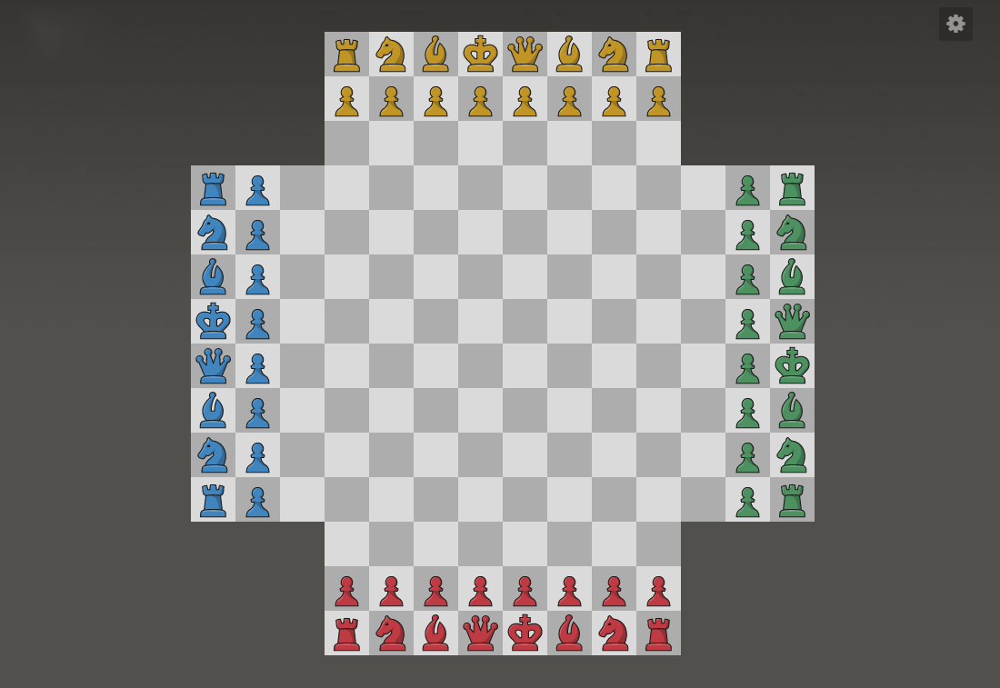
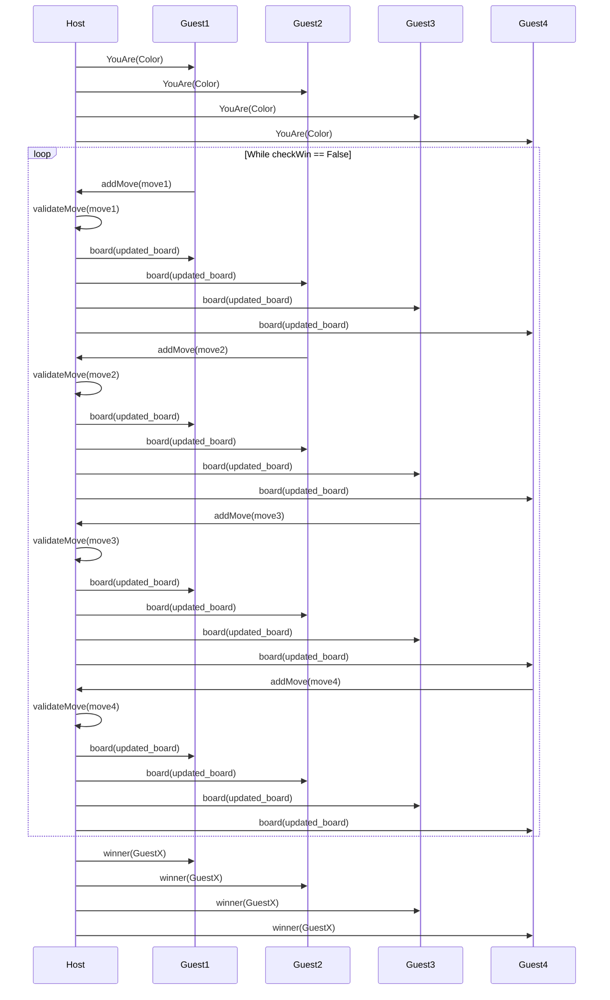

# Échecs à 4 joueurs :

---

## Règles du jeu

---

Les échecs à 4 constituent une variante jouée par quatre personnes en même temps et sur le même échiquier.

Chaque joueur a une couleur différente pour son jeu de pièces, à savoir rouge, bleu, jaune et vert. La partie commence toujours par les rouges et se poursuit dans le sens des aiguilles d'une montre. Une autre différence majeure des échecs à 4 joueurs est l'échiquier, qui compte 160 cases car trois rangées supplémentaires sont ajoutées de chaque côté.

## **Règles standards des échecs à 4 joueurs en mode libre**

---

L'une des variantes les plus connues des échecs à 4 joueurs est le mode libre. Comme vous pouvez le deviner par son nom, dans ce type d'affrontement, chacun des quatre joueurs se bat seul contre les trois autres.

Le but de cette variante est de terminer la partie avec plus de points que ses adversaires. Il existe de nombreuses façons pour un joueur de gagner des points :

- En matant un adversaire (+20)
- En se mettant en situation de pat (+20)
- En mettant en situation de pat un adversaire (+10 pour chaque joueur encore dans la partie)
- En faisant échec à plus d'un roi simultanément avec la dame (+1 pour deux roi, +5 pour trois rois)
- En faisant échec à plus d'un roi simultanément avec une autre pièce que la dame (+5 pour deux rois, +20 pour trois rois)
- En capturant des pièces actives (+1 pour un pion ou une dame promue, +3 pour un cavalier, +5 pour un fou, +5 pour une tour et +9 pour la dame)

Comme aux échecs classiques, les pions sont promus lorsqu'ils atteignent la huitième rangée d'un joueur. Cependant, dans les parties standard en mode libre, un pion est automatiquement promu en dame. Si elle est capturée, cette dame ne rapporte qu'un point au joueur qui la prend.

Au cours de la partie, un joueur est éliminé s'il abandonne, s'il se retrouve pat, s'il se fait mater ou si son temps est écoulé.

Lorsqu'un joueur abandonne ou perd au temps, son roi reste en vie et se déplace au hasard. Mater un roi rapporte 20 points au joueur qui l'exécute tandis que le pat est récompensé de 10 points pour chaque joueur actif restant.

Lorsqu'un joueur se fait mater ou pater, toutes ses pièces deviennent inactives et sont grisées. La capture de ces pièces ne rapporte aucun point.

En cas de nulle par triple répétition, par manque de matériel ou par la règle des 50 coups, tous les joueurs actifs reçoivent 10 points chacun.

La partie se termine lorsque trois joueurs sont éliminés. En outre, une partie peut se terminer lorsqu'il ne reste que deux joueurs et que l'un d'entre eux a une avance de 21 points ou plus sur le tableau d'affichage. Ce joueur peut revendiquer la victoire en abandonnant et en accordant 20 points à l'autre joueur qui ne pourra pas le rattraper.

# Protocole réseau

